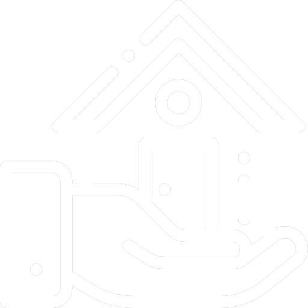

# Imobiliaria-Django </h1>
  

>Um projeto simples usando o Framework Django para desenvolver uma aplicação web de uma imobiliária.

## Ferramentas Utilizadas

As seguintes ferramentas foram usadas na construção do projeto:

- [Python](https://www.python.org/)
- [Django](https://www.djangoproject.com/)

## Licença

Este projeto esta sobe a licença [MIT](LICENSE)
